# OD Inverse Estimation Model Benchmark

Technical report connecting the underdetermined OD↔turning inverse problem, the implementations in `src/ml/rigorous_benchmark/`, and the measured artifacts in `outputs/benchmark/`. Figures live in `docs/figures/od_benchmark/` and are regenerated by `scripts/generate_od_benchmark_doc_figures.py`.

| | |
|--|--|
| Artifact root | `outputs/benchmark/` |
| Seed / split | seed 42; 70 / 15 / 15 on 100 000 FP synthetics |
| Survey | turning index 100000; held out until inference |
| Forward map | $\hat{\mathbf{x}} = \hat{\mathbf{Y}}_{\mathrm{flat}}\, A^\top$ (turning space) |

**Ranking stance (artifacts only — no single “best” model):**

- Synthetic test OD MAE: `mlp` best (646.575605); AE / PLS worst.
- Synthetic test composite: `physics_ridge` ≈ `ridge` best (~1.506); `mlp` third.
- Synthetic forward: `moore_penrose` / `physics_ridge` / `ridge` ≈ 0.
- Survey OD MAE: `nullspace_mlp` best (395.114834); `ridge` / `physics_ridge` worst (~664).
- Survey forward: operator / ridge family ≈ 0; PLS / AE poor.

All numeric claims are from CSV/JSON/NPY artifacts or source code. Missing fields are marked **Not available in the current experiment artifacts.**

---

## Problem statement

We estimate a non-negative origin–destination (OD) matrix $\mathbf{Y}\in\mathbb{R}^{n\times n}$ ($n=24$ Sioux Falls zones; flattened $\mathbf{y}\in\mathbb{R}^{576}$) from observed turning counts $\mathbf{x}\in\mathbb{R}^{m}$ ($m=178$) under a fixed linear assignment operator $A\in\mathbb{R}^{m\times 576}$:

$$
\mathbf{x} = A\mathbf{y}
\quad\text{(exact for clean synthetics)}.
$$

The map $\mathbf{y}\mapsto A\mathbf{y}$ is **underdetermined**: $\mathrm{rank}(A)<576$, so infinitely many OD matrices are consistent with the same turns. Estimation therefore requires a prior (supervised learning on synthetics, Tikhonov penalty, null-space parameterization, etc.).

| Symbol | Meaning |
|--------|---------|
| $\mathbf{x}$ | Turning-count vector (observation) |
| $\mathbf{y}$, $\mathbf{Y}$ | Flattened / matrix OD demand |
| $A$, $A_{\mathrm{turn}}$ | Fractional assignment operator |
| $A^{+}$ | Moore–Penrose pseudoinverse |
| $\hat{\mathbf{y}}$, $\hat{\mathbf{Y}}$ | Estimated OD |
| $\hat{\mathbf{x}} = \hat{\mathbf{y}}\,A^{\top}$ | Forward reconstruction in **turning space** |

---

## Geometry of the inverse problem

From `outputs/benchmark/operator/operator_meta.json` (SVD of the saved $A$ for this run):

| Quantity | Value |
|----------|------:|
| Shape | $178\times 576$ |
| Numerical rank (`rank`) | 170 |
| Nullity | 406 |
| Condition number | $9.214070180877218\times 10^{9}$ |
| Effective rank (99% energy) | 105 |

Prior methodology documents on this network report fractional-assignment analysis rank $\approx 174$ and nullity $\approx 402$ (`docs/synthetic_od_method.tex`, `docs/od_estimation_methodology.tex`). Those are analysis/log references, not this benchmark’s SVD dump; this document privileges `operator_meta.json` and notes the historical 174 for continuity.

The general solution of $A\mathbf{y}=\mathbf{x}$ is

$$
\mathbf{y} = A^{+}\mathbf{x} + N\mathbf{z},\qquad N=\mathrm{null}(A),\ \mathbf{z}\ \text{free},
$$

which is exactly the parameterization used by `nullspace_mlp`.

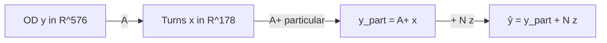

---

## Experimental protocol

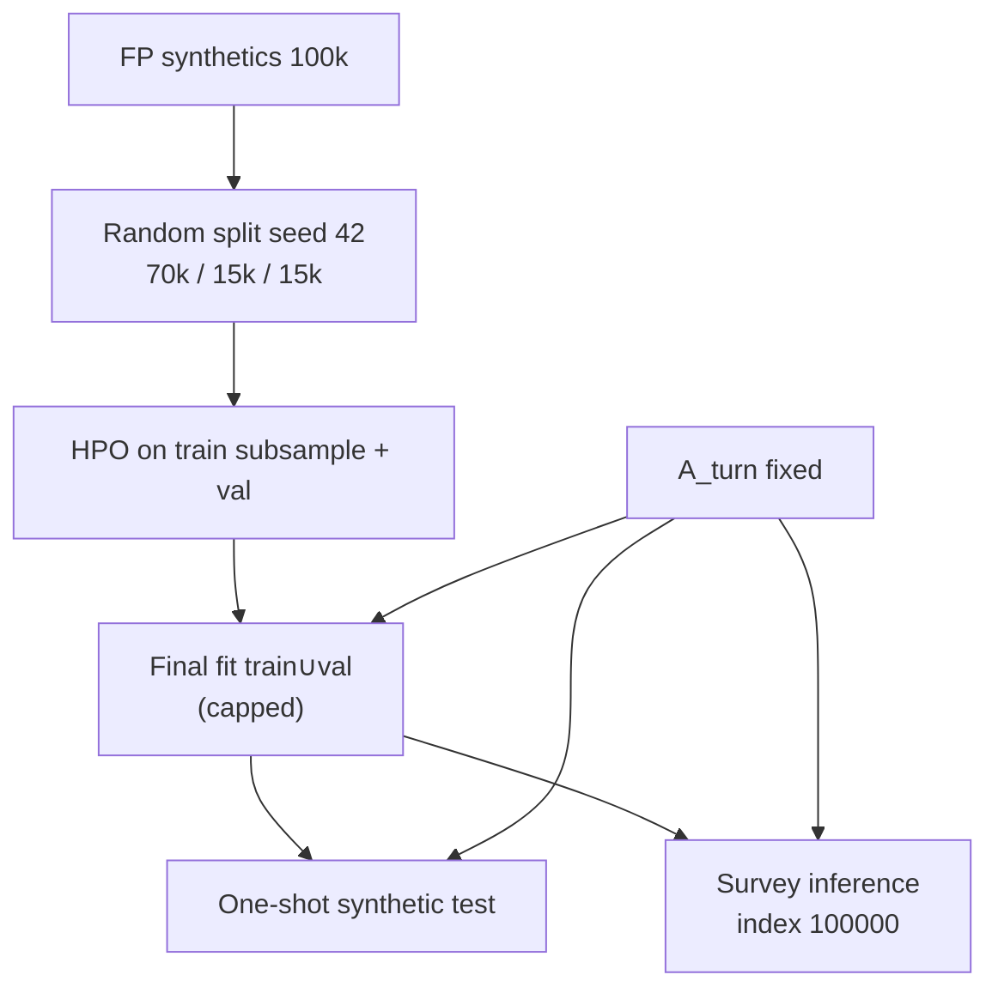

Facts from `data/leakage_report.json` and `run_config.json`:

- FP synthetics only for train/val/test/HPO; survey excluded (`survey_in_train_val_test: false`).
- Scalers fit on **train only**; never refit on survey.
- Composite selection on validation only; test never used for HPO.
- OOM-safe caps: `n_trials=8`, `hpo_train_subsample=5000`, `hpo_val_cap=3000`, `final_train_cap=25000`.
- Full-run wall time (`run_summary.json`): 628.862 s for 13 models.

---

## Data: first-principles OD and fractional assignment

### First-principles OD generation

Implementation: `src/data/first_principles/` + `src/data/generate_fp_od_dataset.py`.

| Stage | Module | Role |
|-------|--------|------|
| A | `latent.py` | Latent production / attraction factors |
| B | `gravity.py` | Gravity kernel + reciprocity |
| C | `heavy_tails.py` | Gamma corridor weights |
| D | `compositional.py` | Dirichlet compositional noise |
| E | `generator.py` | Scaling + IPF |
| F | CLI filters | Dataset quality filters |

Training artifact: `outputs/od_generator_fp/synthetic_od_fp_synthetics_only.npy`, shape $(100000,24,24)$.

### Turning operator $A$

Built by `src/data/generate_turning_counts.py` / `src/data/fractional_assignment.py` (k-shortest paths + logit route choice → fractional $A_{\mathrm{turn}}$).

Paths from `run_config.json`:

- `A_turn`: `outputs/turning_counts_fp/A_turn.npy`
- Turning counts: `outputs/turning_counts_fp/turning_counts.npy`
- SHA-256 of $A$: `09b54843d68eac3904e0a55b941445de41a47d55cc1e8877e80580028e8e1eb9`

Forward sanity (`leakage_report.forward_sanity`): 32 samples checked; `allclose: true`; formula recorded as `X = Y_flat @ A_turn.T`.

---

## Splits, leakage, and preprocessing

| Split | $n$ | Source |
|-------|------:|--------|
| Train | 70 000 | `leakage_report.json` |
| Val | 15 000 | |
| Test | 15 000 | |
| Survey turning index | 100 000 | held out |

- Indices: `outputs/benchmark/data/split_indices.npz` (`train_idx`, `val_idx`, `test_idx`, seed).
- Generator-aware split: **N/A — no per-sample seed metadata in FP artifacts; random split v1** (`leakage_report`).
- Standardization: `standardize_x=true`, `standardize_y=true` (`run_config.json`); scalers in `preprocessing/scalers.joblib`.
- Survey scale diagnostics (`survey_inference/scale_diagnostics.json`): survey $x$ mean shift vs train $-1127.62$; std ratio $0.588$; approximate Wasserstein-1 on $x$ $1268.88$. Scalers **not** refit.

---

## Models

This section documents each estimator as implemented: motivation, equations, architecture (where applicable), training objective, constraints, and the hyperparameters selected for the reported run.

Shared neural training loss (`composite_loss` in `src/ml/neural_trainer.py`), used by MLP-family / AE / nullspace models unless noted:

$$
\mathcal{L}
=
w_{\mathrm{od}}\,\mathrm{MSE}(\hat{\mathbf{y}},\mathbf{y})
+ w_{\mathrm{fwd}}\,\mathrm{MSE}(A\hat{\mathbf{y}},\mathbf{x})
+ w_{\mathrm{prod}}\,\mathrm{MSE}(\hat{\mathbf{P}},\mathbf{P})
+ w_{\mathrm{attr}}\,\mathrm{MSE}(\hat{\mathbf{Q}},\mathbf{Q}),
$$

with defaults $w_{\mathrm{od}}=1.0$, $w_{\mathrm{prod}}=w_{\mathrm{attr}}=0.1$, and $w_{\mathrm{fwd}}$ HPO’d per model. Hidden activations in trunks are **GELU** (`NeuralTrainConfig.activation`). Output nonnegativity is controlled separately by `output_activation` ∈ {`none`, `relu`, `softplus`} after inverse scaling (and after optional residual add). Diagonal cells are zeroed; optional support mask zeros OD pairs never observed in training.

---

### Moore–Penrose pseudoinverse

**Code:** `src/ml/rigorous_benchmark/models/pinv.py` → `pinv_predict`.

**Role.** Unsupervised particular solution of the linear inverse problem. No trainable parameters and no use of OD labels.

**Estimator.**

$$
\hat{\mathbf{y}} = A^{+}\mathbf{x}.
$$

$A^{+}$ is precomputed once from the SVD of $A$ and stored under `outputs/benchmark/operator/`. Among all least-squares solutions of $A\mathbf{y}=\mathbf{x}$, the Moore–Penrose solution is the unique minimum-$\ell_2$-norm particular solution; the free null-space component is identically zero.

**Architecture.** None (closed-form linear algebra).

**Constraints.** `constraint_strategy=none`: negatives and diagonal leakage are allowed in the reported main run (ablations explore post-hoc clips).

**HPO.** None. Best params: `{}`.

**What it measures.** Pure operator consistency. Near-zero forward RMSE is expected; OD MAE reflects how far the FP / survey prior sits from the minimum-norm particular solution.

---

### Tikhonov regularization

**Code:** `src/ml/rigorous_benchmark/models/tikhonov.py` (`tikhonov_solve` via `cho_solve`).

**Role.** Classical unsupervised regularized least squares on the known operator. **Does not use OD labels** at fit or predict time. Distinct from supervised Ridge (below).

**Estimator.**

$$
\hat{\mathbf{y}}
=
\arg\min_{\mathbf{y}}
\|A\mathbf{y}-\mathbf{x}\|_2^2 + \lambda\|\mathbf{y}\|_2^2
\quad\Leftrightarrow\quad
(A^\top A + \lambda I)\mathbf{y} = A^\top\mathbf{x}.
$$

Implementation factors $A^\top A+\lambda I$ once (Cholesky) and solves against right-hand sides $X A$ for batches of $\mathbf{x}$. Identity Tikhonov matrix $L=I$ only.

**Architecture.** None (closed-form linear solve).

**HPO.** $\lambda\in[10^{-6},10^{6}]$ log-uniform, selected by validation composite.  
**Selected:** $\lambda = 1.0540913515845597\times 10^{-6}$ (`tikhonov/best_params.json`).  
Separate `hpo_best.json` best_value: **Not available in the current experiment artifacts.**

**What it measures.** Same geometry as pinv when $\lambda\to 0$; small $\lambda$ here yields near-pinv behaviour with mild damping of high-frequency singular directions.

---

### Supervised Ridge

**Code:** `src/ml/rigorous_benchmark/models/ridge.py` (sklearn multi-output `Ridge`).

**Role.** Learn a linear map from turning counts to OD from labelled synthetics. **$A$ is not used at predict time** — physics enters only indirectly through the synthetic $(X,Y)$ pairs.

**Estimator.** Fit on scaled $\mathbf{x}$ → raw $\mathbf{y}$:

$$
\hat{\mathbf{y}} = W\mathbf{x}_{\mathrm{scaled}} + \mathbf{b},
\qquad
\min_{W,\mathbf{b}}
\|\mathbf{Y}-XW^\top\|_F^2 + \alpha\|W\|_F^2
$$

(sklearn’s multi-target Ridge; each OD cell is a separate target sharing the same $\alpha$).

**Architecture.** Linear multi-output regressor: input dim 178 → output dim 576 (plus intercept). No hidden layers.

**HPO.** $\alpha\in[10^{-4},10^{5}]$ log-uniform.  
**Selected:** $\alpha = 0.00010403002134459767$.

**Constraints.** `none` in the main run (negatives allowed). Ablations apply relu/clip/IPF post-hoc.

**What it measures.** How well a linear supervised prior matches the FP distribution and how much that prior conflicts with survey OD under distribution shift.

---

### Physics Ridge

**Code:** `src/ml/rigorous_benchmark/models/physics_ridge.py`.

**Role.** Hybrid: supervised Ridge prior $\mathbf{y}_0$, then a **closed-form** refine that pulls the prediction toward the forward constraint $A\mathbf{y}\approx\mathbf{x}$.

**Two-stage estimator.**

1. Fit Ridge as above → $\mathbf{y}_0$.
2. Refine:

$$
\mathbf{y}
\leftarrow
\arg\min_{\mathbf{y}}
\|\mathbf{y}-\mathbf{y}_0\|_2^2 + \mu\|A\mathbf{y}-\mathbf{x}\|_2^2
\quad\Leftrightarrow\quad
(I + \mu A^\top A)\mathbf{y} = \mathbf{y}_0 + \mu A^\top\mathbf{x}.
$$

**Critical distinction from Tikhonov.** Tikhonov has no supervised $\mathbf{y}_0$ and shrinks toward $\mathbf{0}$. Physics Ridge shrinks toward the Ridge prediction while enforcing forward consistency with strength $\mu$.

**Architecture.** Same linear Ridge map as above, plus one Cholesky solve per prediction batch (no neural net).

**HPO.** $\alpha\in[10^{-4},10^{5}]$, $\mu\in[10^{-6},10^{2}]$ (log).  
**Selected:** $\alpha=0.00011692997958212092$, $\mu=50.62467440787875`.

**What it measures.** Whether a strong forward refine can keep composite / forward near perfect while retaining Ridge’s synthetic OD accuracy. Survey results show that refine does **not** rescue a mismatched prior.

---

### Partial least squares (PLS)

**Code:** `src/ml/rigorous_benchmark/models/pls.py` (`sklearn.cross_decomposition.PLSRegression`).

**Role.** Supervised latent linear map $X\to Y$ with a small number of latent components; useful when $X$ and $Y$ are jointly collinear.

**Estimator.** PLS with `scale=False`, `n_components` HPO’d. Predict: scaled $\mathbf{x}$ → raw $\mathbf{y}$. No use of $A$ at predict.

**Architecture (conceptual).**

```
x (178) ──► [PLS latent space, k components] ──► y (576)
```

Not a neural net; sklearn’s NIPALS-style PLS.

**HPO.** `n_components` ∈ [2, max feasible ≤ 20].  
**Selected:** `n_components=20`.

**What it measures.** Low-rank linear transfer. On this run it underfits synthetic OD/forward relative to Ridge/MLP, but transfers relatively well on the single survey matrix (second-best survey OD MAE).

---

### Direct MLP

**Code:** `src/ml/rigorous_benchmark/models/mlp.py` + `DirectODRegressor` in `src/ml/neural_core.py` with `residual_blocks=False`.

**Role.** Nonlinear supervised map $\mathbf{x}\mapsto\mathbf{y}$ that can place mass in the null space of $A$ according to the FP prior. $A$ enters **only through the forward term of the loss**, not as a hard constraint at predict.

**Architecture (selected run).**

```
Input: scaled turning counts  x ∈ R^{178}
        │
        ▼
   Linear 178 → 512 + GELU
        │
        ▼
   Linear 512 → 1024 + GELU
        │
        ▼
   Linear 1024 → 576          (logits in scaled-Y space)
        │
        ▼
   Inverse Y-scaler → raw OD
        │
        ▼
   output_activation = ReLU
        │
        ▼
   Zero diagonal; optional support mask
        │
        ▼
Output: ŷ ∈ R^{576}
```

Layer widths come from HPO `hidden0=512`, `hidden1=1024`. Trunk activation is GELU (config default). No residual blocks.

**Training.** Adam; early stopping on validation OD MAE; composite loss with HPO’d `forward_weight`. Final fit uses train∪val capped at 25 000 samples.

**Selected hyperparameters** (`mlp/best_params.json`):

| Hyperparameter | Value |
|----------------|------:|
| hidden0 / hidden1 | 512 / 1024 |
| lr | 0.0016755052359850296 |
| weight_decay | 1.1756010900231857e-05 |
| batch_size | 256 |
| forward_weight | 1.6043939615080793 |
| output_activation | relu |

Best val MAE during fit: 642.105225 (in same file). Parameter count in CSV: **Not available in the current experiment artifacts.**

**What it measures.** Strongest synthetic OD prior among reported models; pays a forward-error cost (~340 RMSE) because the hypothesis class is unconstrained in the null space.

---

### Residual MLP

**Code:** `src/ml/rigorous_benchmark/models/residual_mlp.py` + `DirectODRegressor(..., residual_blocks=True)`.

**Role.** Same supervised $X\to Y$ problem as the MLP, but with **architectural** residual blocks (ResBlocks) for deeper feature transforms at fixed width. This is **not** residual learning from a base OD matrix.

**Architecture (selected run: width 512, 3 ResBlocks).**

Each `ResBlock(dim)` (`neural_core.py`):

$$
h \leftarrow h + W_2\,\sigma(W_1 h),\qquad \sigma=\mathrm{GELU}.
$$

Full forward:

```
Input: x ∈ R^{178}
        │
        ▼
   Linear 178 → 512 + GELU          (in_proj)
        │
        ▼
   ResBlock × 3  (width 512)        # architectural skip connections
        │
        ▼
   Linear 512 → 576                 (out_proj logits)
        │
        ▼
   Inverse Y-scaler → raw OD
        │
        ▼
   softplus; zero diagonal; support mask
        │
        ▼
Output: ŷ ∈ R^{576}
```

HPO forces `hidden0 = hidden1 = width` ∈ {128, 256, 512} and `num_res_blocks` ∈ {1, 2, 3}.

**Selected hyperparameters:**

| Hyperparameter | Value |
|----------------|------:|
| width (= hidden0 = hidden1) | 512 |
| num_res_blocks | 3 |
| lr | 0.0009616005310543457 |
| weight_decay | 4.857295179217169e-06 |
| batch_size | 128 |
| forward_weight | 1.3945464785138597 |
| output_activation | softplus |
| parameters (CSV) | 1 963 072 |

**What it measures.** Whether deeper residual capacity improves over the plain MLP under the same composite objective. On this run it is slightly worse than MLP on synthetic OD MAE (657 vs 647) with similar survey behaviour.

---

### Physics Residual MLP

**Code:** `src/ml/rigorous_benchmark/models/physics_residual_mlp.py`.

**Role.** Two “physics” ingredients on top of Residual MLP:

1. **Elevated forward weight** HPO range `physics_forward_weight` ∈ [0.5, 3.0] (vs shared neural range [0, 1.5]).
2. **Residual learning from a fixed base OD:** `residual_learning=True` in `logits_to_od` adds `base_od_flat`, which `data.py` sets to the **survey** OD vector. The network therefore predicts a correction $\Delta\mathbf{y}$ around that base:

$$
\hat{\mathbf{y}}
=
\mathrm{act}\big(
  \mathrm{unscale}(f_\theta(\mathbf{x})) + \mathbf{y}_{\mathrm{survey}}
\big)
\quad\text{(then zero diagonal / mask)}.
$$

**Architecture (selected: width 512, 1 ResBlock).** Same ResBlock trunk as Residual MLP, but shallower:

```
x (178) → Linear→512+GELU → ResBlock×1 → Linear→576
         → unscale → + y_survey → ReLU → diag0 / mask
```

**Selected hyperparameters:**

| Hyperparameter | Value |
|----------------|------:|
| width | 512 |
| num_res_blocks | 1 |
| lr | 0.0011256123615936324 |
| weight_decay | 7.947147424653752e-05 |
| batch_size | 64 |
| forward_weight | 2.740228249808733 |
| output_activation | relu |
| parameters (CSV) | 912 448 |

**Distinction from Residual MLP.** Residual MLP = ResBlocks only. Physics Residual MLP = ResBlocks **+** survey-base residual add **+** higher forward weight. Anchoring to survey OD is a strong inductive bias for survey inference but couples the synthetic training objective to a single external matrix.

---

### Autoencoder family (`ae_32`, `ae_64`, `ae_128`, `ae_64_finetune`)

**Code:** `src/ml/rigorous_benchmark/models/autoencoder.py` + `ODEncoder` / `ODDecoder` / `LatentPredictor` / `LatentODModel` in `neural_core.py`.

**Role.** Compress OD matrices into a latent bottleneck, then learn to predict that latent from turning counts. Intended to enforce a low-dimensional OD manifold prior.

**Architecture.** Fixed AE widths from config `latent_hidden=(256, 128)` (not HPO’d). Latent dim $d\in\{32,64,128\}$.

**Stage 1 — OD autoencoder pretrain** (labels only; no $X$):

```
y_scaled (576)
   → Linear 576→256 + GELU → Linear 256→128 + GELU → Linear 128→d     (encoder)
   → Linear d→128 + GELU → Linear 128→256 + GELU → Linear 256→576     (decoder)
   → logits_to_od → MSE(pred, y_raw)
```

**Stage 2 — Latent predictor** (decoder frozen):

```
x_scaled (178)
   → Linear 178→h0 + GELU → Linear h0→h1 + GELU → Linear h1→d        (LatentPredictor)
   → frozen decoder → logits_to_od
Loss = MSE(z_pred, z_encoder(y)) + composite_loss(ŷ, y, x, A)
```

**Stage 3 — optional finetune** (`ae_64_finetune` only): unfreeze decoder; train end-to-end with composite loss for `finetune_epochs` (default 15) at `finetune_lr` (default $10^{-4}$).

**Selected run configs** (from each `best_params.json`):

| Model | Latent $d$ | Finetune | h0 / h1 | forward_weight | output_act | parameters |
|-------|----------:|:--------:|--------:|---------------:|------------|-----------:|
| ae_32 | 32 | no | 512 / 512 | 0.277282 | softplus | 556 000 |
| ae_64 | 64 | no | 512 / 512 | 0.277282 | softplus | 576 512 |
| ae_128 | 128 | no | 512 / 512 | 0.456921 | relu | 617 536 |
| ae_64_finetune | 64 | yes | 512 / 512 | 0.456921 | relu | 576 512 |

**What it measures.** Whether a low-dim OD manifold helps. Under this HPO budget, all AE variants underperform MLP/Ridge on synthetic OD and show large forward errors — bottleneck capacity and/or training protocol appear insufficient for the underdetermined inverse.

---

### Nullspace MLP

**Code:** `src/ml/rigorous_benchmark/models/nullspace_mlp.py`.

**Role.** Explicitly parameterize the affine solution set of $A\mathbf{y}=\mathbf{x}$. The network predicts only null-space coefficients; the particular solution is hard-wired.

**Estimator.**

$$
\hat{\mathbf{y}}
=
A^{+}\mathbf{x} + N\, f_\theta(\mathbf{x}_{\mathrm{scaled}}),
$$

where $N\in\mathbb{R}^{576\times k}$ is an orthonormal null basis ($k=$nullity $=406$ in this run) and $f_\theta:\mathbb{R}^{178}\to\mathbb{R}^{k}$.

**Architecture (`NullspaceNet`).** Reuses `DirectODRegressor` as a trunk with **output dimension = nullity** (not 576):

```
x_scaled (178)
   → Linear 178→512 + GELU
   → Linear 512→256 + GELU
   → Linear 256→406                 (z coefficients)
        │
        ▼
ŷ = A⁺ x_raw  +  z @ Nᵀ            (hard particular + null correction)
        │
        ▼
softplus; zero diagonal; support mask
```

**Training extras.** Soft null penalty $\lambda_{\mathrm{null}}\|A(N\mathbf{z})\|_2^2$ added to composite loss so that the learned correction stays approximately in $\ker(A)$ even after nonlinear constraints. After softplus / diagonal masking, exact null membership is **not** guaranteed (see null-space diagnostics).

**Selected hyperparameters:**

| Hyperparameter | Value |
|----------------|------:|
| hidden0 / hidden1 | 512 / 256 |
| lr | 0.001716044502975482 |
| weight_decay | 0.0007886714129990489 |
| batch_size | 64 |
| forward_weight | 1.0263495397682354 |
| output_activation | softplus |
| null_penalty | 0.029914693021302164 |
| parameters (CSV) | 327 318 |

**What it measures.** Learning a prior **restricted to** the null space. Best survey OD MAE in this run; middling synthetic OD and imperfect forward (soft penalty + post-activations).

---

## Architecture and design comparison

| Model | Predict uses $A$? | Learns OD prior? | Explicit null-space? | Constraint (reported) | Hypothesis class |
|-------|:-----------------:|:----------------:|:--------------------:|-----------------------|------------------|
| moore_penrose | yes ($A^{+}$) | no | particular only | none | min-norm LS |
| tikhonov | yes | weak ($\ell_2$) | no | none | Tikhonov LS |
| ridge | no | yes (linear) | implicit | none | linear $X\to Y$ |
| physics_ridge | yes (refine) | yes + physics | implicit | none | Ridge + forward pull |
| pls | no | yes (latent linear) | no | none | PLS rank-$k$ |
| mlp | loss only | yes (MLP) | no | relu | 178→512→1024→576 |
| residual_mlp | loss only | yes (ResBlocks) | no | softplus | 178→512→Res×3→576 |
| physics_residual_mlp | loss only | yes + survey base | no | relu | Res×1 + $\mathbf{y}_{\mathrm{survey}}$ |
| ae_* | loss only | yes (AE manifold) | no | softplus/relu | $X\to$ latent $\to$ OD |
| nullspace_mlp | yes ($A^{+},N$) | yes ($f_\theta$) | **yes** | softplus | $A^{+}x + N z(x)$ |

---

## Hyperparameter search and selection

Shared neural suggestions (`neural_train.suggest_neural_params`): `hidden0`∈{128,256,512}, `hidden1`∈{256,512}, `lr` log $[10^{-4},2\times10^{-3}]$, `weight_decay` log $[10^{-6},10^{-3}]$, `batch_size`∈{64,128,256}, `forward_weight`∈[0,1.5], `output_activation`∈{none,relu,softplus}.

Selection objective: validation **composite** (see Metrics), `n_trials=8`.

Validation HPO best values (`*/hpo_best.json` `best_value`):

| Model | Val composite (HPO best) |
|-------|-------------------------:|
| physics_ridge | 1807.137163 |
| ridge | 1807.155101 |
| mlp | 2229.268670 |
| physics_residual_mlp | 2345.978975 |
| residual_mlp | 2359.541547 |
| ae_64_finetune | 3277.275964 |
| ae_128 | 3622.819995 |
| pls | 3626.762514 |
| ae_64 | 3705.674493 |
| ae_32 | 3776.059770 |
| nullspace_mlp | 4217.626729 |

Moore–Penrose: no HPO. Tikhonov HPO best_value: **Not available in the current experiment artifacts.**

---

## Metrics

Implemented in `src/ml/rigorous_benchmark/metrics_suite.py`.

**Forward (turning space):**

$$
\hat{\mathbf{x}} = \hat{\mathbf{Y}}_{\mathrm{flat}}\, A^\top,\qquad
\text{forward MAE/RMSE on }\mathbf{x}-\hat{\mathbf{x}}.
$$

**OD metrics:** MAE, RMSE, $R^2$, Pearson, Spearman (capped `metrics_spearman_samples=500`), relative error, sparsity error, negative cells, diagonal violation.

**Marginals:** production / attraction MAE & RMSE.

**Inverse-problem extras:** `mean_l2_to_pinv`, `mean_rel_nullspace_leak_via_A`.

**Composite (selection / ranking):**

$$
\mathrm{score} = n\mathrm{MAE}_{\mathrm{OD}} + \alpha\, n\mathrm{Fwd} + \beta\, n\mathrm{Prod} + \gamma\, n\mathrm{Attr},
$$

with $\alpha=1.0$, $\beta=\gamma=0.5$ (`run_config.json`). Test composites use validation-set references (`selection.attach_composite`).

**Unavailable in artifacts:** entropy difference, trip-length / distance-bin errors, zone-distance stratified error.

---

## Synthetic test results

Source: `outputs/benchmark/benchmark_results.csv` (exact floats). Tables are split so columns remain readable in Markdown and PDF.

### OD accuracy (synthetic test)

| Rank | Model | OD MAE | Pearson | Composite |
|-----:|-------|-------:|--------:|----------:|
| 1 | mlp | 646.575605 | 0.624761 | 1.852621 |
| 2 | residual_mlp | 657.214350 | 0.608259 | 1.965311 |
| 3 | physics_residual_mlp | 667.663681 | 0.586593 | 1.934136 |
| 4 | nullspace_mlp | 680.165591 | 0.494405 | 3.166864 |
| 5 | ridge | 697.985720 | 0.614995 | 1.506371 |
| 6 | physics_ridge | 698.036344 | 0.614942 | 1.506216 |
| 7 | moore_penrose | 731.185951 | 0.461912 | 3.390996 |
| 8 | tikhonov | 734.362355 | 0.429899 | 3.654341 |
| 9 | ae_64_finetune | 791.845282 | 0.357722 | 3.285658 |
| 10 | pls | 817.568364 | 0.301449 | 4.189618 |
| 11 | ae_128 | 820.910334 | 0.274172 | 3.951162 |
| 12 | ae_64 | 824.707534 | 0.253679 | 4.252426 |
| 13 | ae_32 | 831.729739 | 0.235525 | 4.525160 |

**Composite ranking (lower better):** physics_ridge (1.506216) &lt; ridge (1.506371) &lt; mlp (1.852621) &lt; …

### Forward consistency and marginals (synthetic test)

| Model | Forward RMSE | Prod MAE | Attr MAE |
|-------|-------------:|---------:|---------:|
| moore_penrose | 8.536e-05 | 4705.106327 | 4706.964408 |
| physics_ridge | 0.002614 | 1100.299023 | 1093.898000 |
| tikhonov | 0.132546 | 5213.960843 | 5214.147098 |
| ridge | 0.247070 | 1100.213968 | 1093.815987 |
| mlp | 339.939142 | 1065.576747 | 1052.385210 |
| physics_residual_mlp | 344.249327 | 1159.121027 | 1158.029047 |
| residual_mlp | 372.933580 | 1173.803640 | 1165.446359 |
| nullspace_mlp | 798.842649 | 2783.060571 | 2802.462876 |
| ae_64_finetune | 1227.010749 | 1267.937464 | 1242.946557 |
| ae_128 | 1618.408914 | 1572.240635 | 1546.554931 |
| pls | 1876.895504 | 1621.738799 | 1617.774040 |
| ae_64 | 1906.380269 | 1487.594875 | 1485.121037 |
| ae_32 | 2118.186015 | 1501.644228 | 1516.763000 |

### Plots — synthetic test

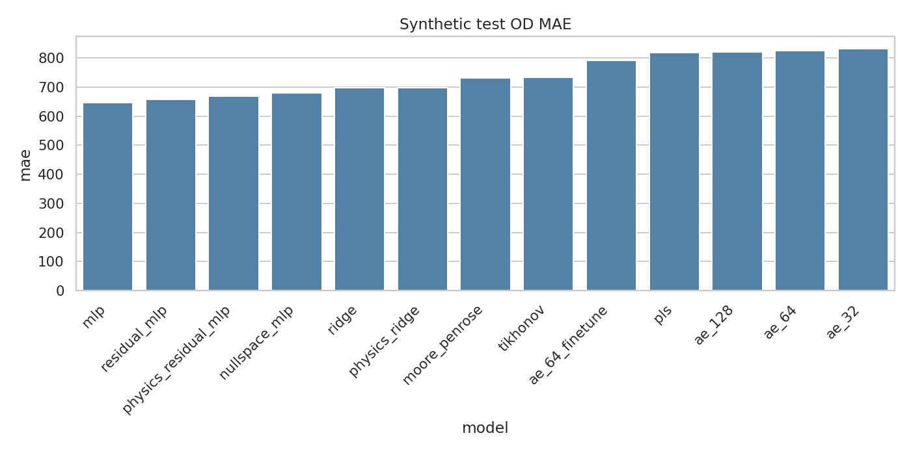

**Figure — test OD MAE.** Mean absolute error on the held-out 15 000 synthetic OD matrices (lower is better). Bars are ordered by model as produced by the figure script. The MLP bar is lowest (~647); residual / physics-residual / nullspace follow; AE and PLS form the high-error cluster (~792–832). This plot answers “who recovers the FP OD prior on in-distribution synthetics?” — not who is forward-consistent.

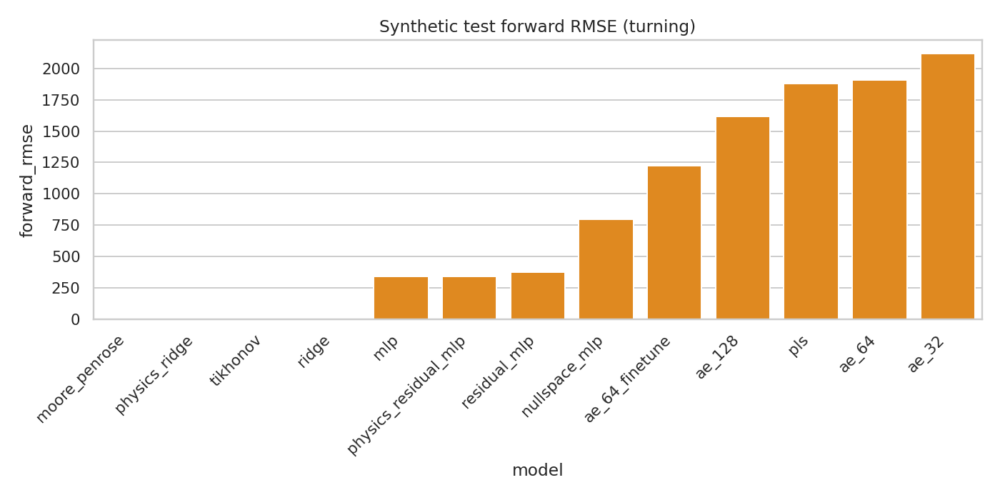

**Figure — test forward RMSE.** RMSE of $\hat{\mathbf{x}}=A\hat{\mathbf{y}}$ vs observed turns. Operator and ridge-family bars sit near zero (logically expected for methods that solve or refine with $A$). Neural / AE / PLS bars are orders of magnitude larger. Comparing this plot to OD MAE shows the classic trade-off: low OD error does not imply low forward error when the null space is large.

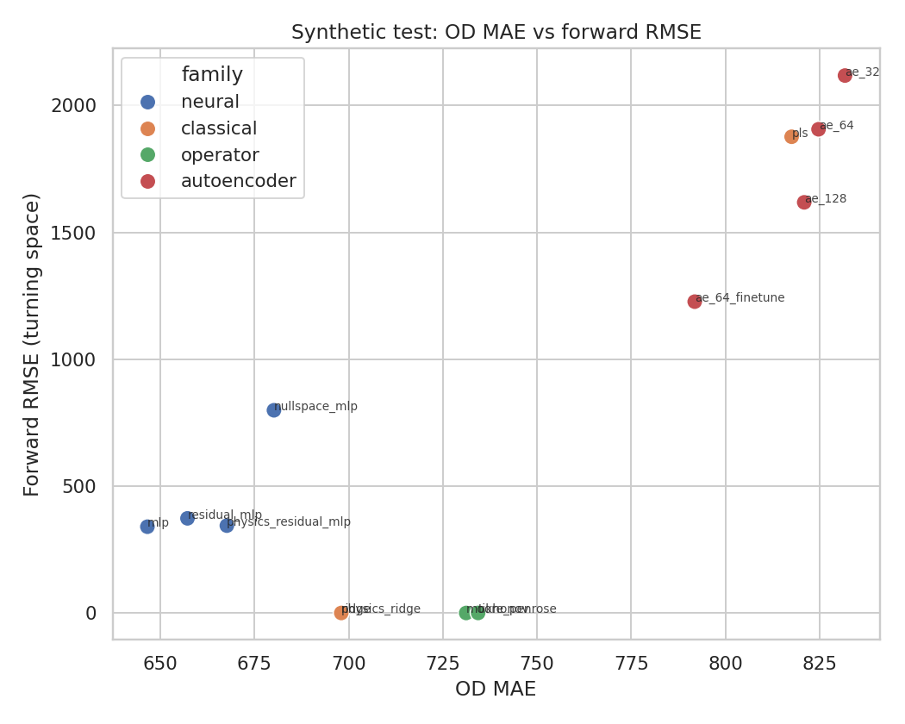

**Figure — OD vs forward Pareto (test).** Each point is one model. Ideal is bottom-left (low OD MAE and low forward RMSE). Ridge / physics_ridge occupy the low-forward, mid-OD region; MLP occupies lower OD but higher forward; AE/PLS sit upper-right (worse on both axes under this protocol). There is no model in the ideal corner — evidence that a single scalar ranking is insufficient.

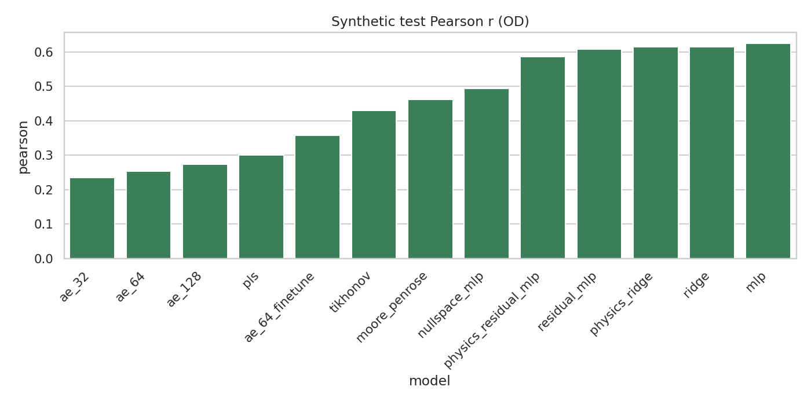

**Figure — test Pearson correlation.** Cell-wise correlation between predicted and true OD (higher better). Tracks OD MAE ordering roughly: MLP / residual / ridge highest (~0.61–0.62); AE_32 lowest (~0.24). Pearson rewards linear association even when absolute scale errs; still, AE/PLS remain weak.


**Figure — test production MAE.** Error on row sums (trips leaving each origin). Moore–Penrose and Tikhonov are catastrophic (~4700–5200) despite near-perfect forward — the particular / Tikhonov solutions do not match FP total productions. Supervised models keep production MAE near ~1100–1600; nullspace_mlp is worse (~2783), consistent with unconstrained total demand along null directions after softplus.

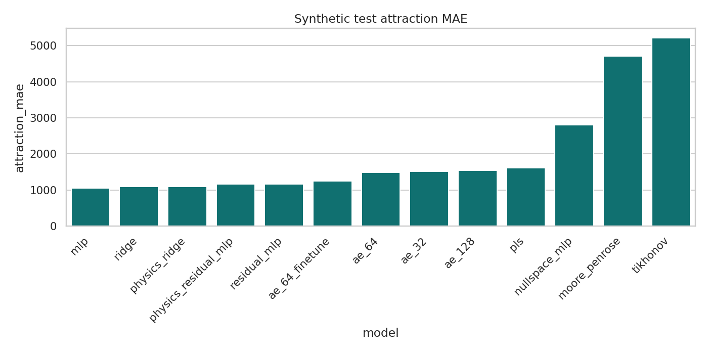

**Figure — test attraction MAE.** Column-sum errors. Pattern mirrors production MAE: operator methods fail on marginals; supervised models are far better; nullspace sits in between.

### Interpretation of synthetic rankings

- **MLP wins OD MAE** by learning a strong synthetic prior in the large null space, at the cost of non-zero forward error (~340 RMSE).
- **Physics Ridge / Ridge win composite** because forward error is essentially zero while OD MAE remains competitive (~698); composite heavily weights forward/marginals after val normalization.
- **Moore–Penrose / Tikhonov** nearly perfect forward consistency but poor OD MAE and disastrous production/attraction MAE — they recover a particular solution, not the FP prior.
- **Nullspace MLP** sits between: better OD than pinv, worse forward than ridge, weaker synthetic OD than plain MLP — consistent with a constrained hypothesis class $A^{+}\mathbf{x}+N\mathbf{z}$.
- **AE / PLS** underperform on both OD and forward under this HPO budget (`n_trials=8`, capped train).

---

## Survey inference results

Source: `outputs/benchmark/survey_inference/survey_results.json` (one survey OD realization). Tables split for readability.

### Survey OD accuracy

| Rank | Model | OD MAE | Pearson |
|-----:|-------|-------:|--------:|
| 1 | nullspace_mlp | 395.114834 | 0.488878 |
| 2 | pls | 418.039700 | 0.374540 |
| 3 | moore_penrose | 444.140140 | 0.418043 |
| 4 | ae_64_finetune | 451.962092 | 0.329399 |
| 5 | ae_32 | 465.063583 | 0.197415 |
| 6 | tikhonov | 466.588330 | 0.243907 |
| 7 | ae_64 | 485.612941 | 0.236571 |
| 8 | physics_residual_mlp | 512.339152 | 0.211974 |
| 9 | ae_128 | 514.507728 | 0.222108 |
| 10 | mlp | 527.377343 | 0.211658 |
| 11 | residual_mlp | 527.626517 | 0.219909 |
| 12 | ridge | 664.032835 | 0.168075 |
| 13 | physics_ridge | 664.149324 | 0.168054 |

### Survey forward consistency, marginals, and null-space proximity

| Model | Forward RMSE | Prod MAE | Attr MAE | $\ell_2$ to pinv | Rel.\ null leak |
|-------|-------------:|---------:|---------:|-----------------:|----------------:|
| moore_penrose | 3.607e-05 | 6046.130955 | 6046.130955 | 0.0 | 0.0 |
| physics_ridge | 0.005382 | 5991.510249 | 6050.212830 | 23615.960148 | 1.26e-06 |
| ridge | 0.156431 | 5991.069385 | 6049.726024 | 23615.524453 | 3.66e-05 |
| tikhonov | 0.259294 | 7242.966101 | 7242.966101 | 7611.792835 | 6.07e-05 |
| physics_residual_mlp | 280.397207 | 6114.335692 | 6003.717958 | 23056.313305 | 0.065592 |
| mlp | 325.749433 | 5931.444914 | 5806.048229 | 24038.045183 | 0.076201 |
| nullspace_mlp | 374.365287 | 4343.379282 | 4427.213110 | 11648.343245 | 0.087573 |
| residual_mlp | 411.646022 | 5791.312941 | 5981.157951 | 22978.867064 | 0.096294 |
| ae_64_finetune | 971.987312 | 6034.791032 | 6335.327453 | 18963.821577 | 0.227372 |
| ae_128 | 1255.887706 | 6131.061538 | 6011.479929 | 19773.213635 | 0.293784 |
| pls | 1292.271232 | 6314.272479 | 6298.194063 | 16653.608115 | 0.302295 |
| ae_64 | 1586.096551 | 5900.370275 | 6212.968683 | 18560.692864 | 0.371028 |
| ae_32 | 1867.307089 | 6187.208738 | 6351.626751 | 17293.434131 | 0.436810 |

Survey $R^2$: recorded as `NaN` in JSON for all models (degenerate total sum of squares) — **Not available as a meaningful scalar in the current experiment artifacts.**

### Plots — survey

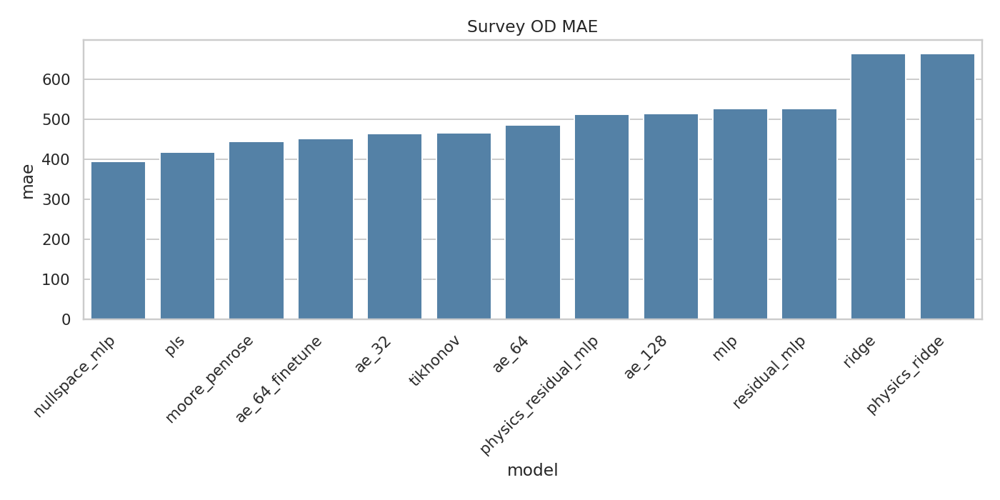

**Figure — survey OD MAE.** Absolute error vs the single held-out survey OD matrix. Ranking **reverses** relative to synthetic test: `nullspace_mlp` is best (~395), then PLS / pinv; MLP falls to ~527; ridge / physics_ridge are worst (~664). Read this as out-of-distribution transfer under fixed $A$, not as a second synthetic leaderboard.

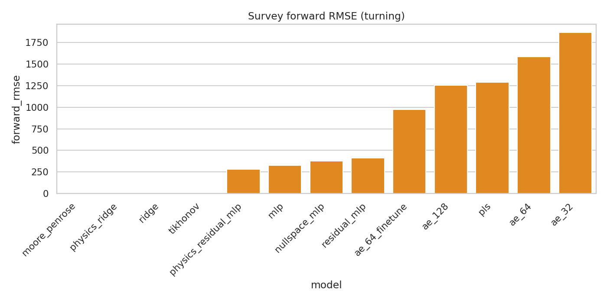

**Figure — survey forward RMSE.** Operator and ridge-family methods remain near zero. Neural models keep moderate forward error; AE/PLS again large. Forward excellence on survey does **not** predict OD MAE (ridge has ~0 forward and worst OD).

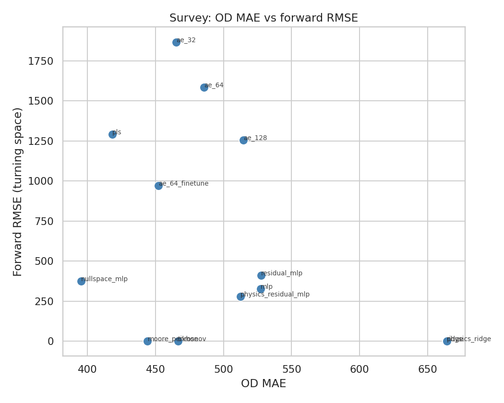

**Figure — survey OD vs forward scatter.** Nullspace_mlp sits at comparatively low OD MAE with moderate forward error. Moore–Penrose is near-zero forward with mid OD MAE. Ridge/physics_ridge hug the forward axis but sit far right on OD MAE. The spread visualizes why “best model” depends on the chosen axis.

### Disagreement with synthetic test

MLP best on synthetic OD; **nullspace_mlp** best on survey OD; ridge/physics_ridge best on synthetic composite but **worst** survey OD MAE. Explained by distribution shift (scale diagnostics above) and nullity: models that memorize the FP prior transfer poorly; models that stay near the affine solution set $A^{+}\mathbf{x}+N\mathbf{z}$ or the particular solution transfer better on this single survey matrix.

---

## Null-space diagnostics

Artifact-derived (`docs/figures/od_benchmark/nullspace_diagnostics.json`), using survey `moore_penrose_od.npy` vs `nullspace_mlp_od.npy` and `operator/a_pinv.npy` (no checkpoint restore):

| Quantity | Value |
|----------|------:|
| Survey OD MAE (pinv) | 444.140139 |
| Survey OD MAE (nullspace_mlp) | 395.114833 |
| $\|\hat{\mathbf{y}}_{\mathrm{ns}}-A^{+}\mathbf{x}\|$ | 11685.562730 |
| $\|\hat{\mathbf{y}}_{\mathrm{ns}}-\hat{\mathbf{y}}_{\mathrm{pinv}}\|$ | 11648.343245 |
| $\|A(\hat{\mathbf{y}}_{\mathrm{ns}}-\hat{\mathbf{y}}_{\mathrm{pinv}})\|$ | 4994.655938 |
| Relative leak via $A$ | 0.087573 |
| Mean |cell| of null component | 276.988316 |

Interpretation (hypothesis language): nullspace_mlp applies a large OD-space correction relative to $A^{+}\mathbf{x}$; residual forward leakage (~0.088 relative) shows the soft null penalty and output constraints do not enforce $A N\mathbf{z}=\mathbf{0}$ exactly after softplus/masking.

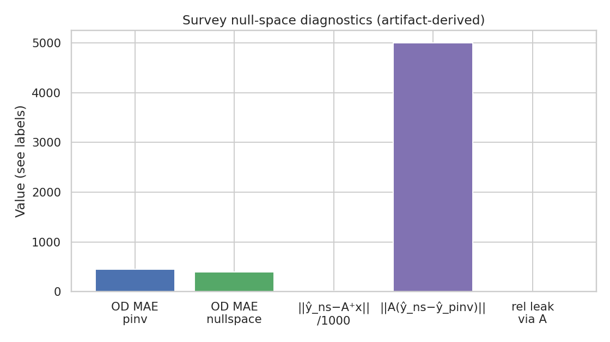

**Figure — nullspace diagnostics bars.** Summarizes the magnitudes above: OD improvement vs pinv, size of the correction $\|y_{\mathrm{ns}}-y_{\mathrm{pinv}}\|$, and residual $\|A\Delta y\|$. Large correction with non-zero leak is the expected signature of a soft-constrained null-space learner.

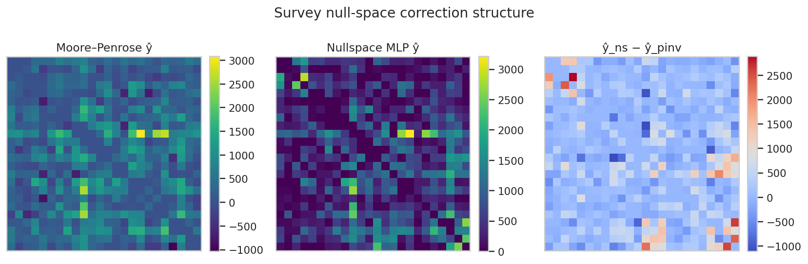

**Figure — nullspace correction heatmaps.** Spatial structure of $y_{\mathrm{ns}}-y_{\mathrm{pinv}}$ (and related panels from the script). Bright corridors are OD pairs where the MLP injects null-space demand that pinv cannot express; this is the learned prior component.

---

## Failure modes

| Failure mode | Evidence | Models implicated |
|--------------|----------|-------------------|
| Perfect forward, wrong OD | Forward RMSE ≈ 0, high OD/prod MAE | moore_penrose, tikhonov, ridge*, physics_ridge* |
| Good synthetic OD, weak survey OD | MLP #1 test / #10 survey | mlp, residual_mlp |
| Forward collapse | Forward RMSE ≫ 10³ | ae_*, pls |
| Negatives | `negative_cells` > 0 on test | ridge, physics_ridge, moore_penrose, tikhonov, pls |
| Marginal mismatch | Prod/attr MAE ≫ OD MAE | pinv, tikhonov, nullspace (survey total demand error 55607.5) |

\*Ridge family: near-perfect forward **and** competitive synthetic OD, but survey OD collapses — prior mismatch, not forward failure.

---

## Heatmap analysis

### Survey heatmaps (primary)

Each figure shows true survey OD, model prediction, and absolute error as $24\times 24$ panels (same color scale within a figure as produced by the script).

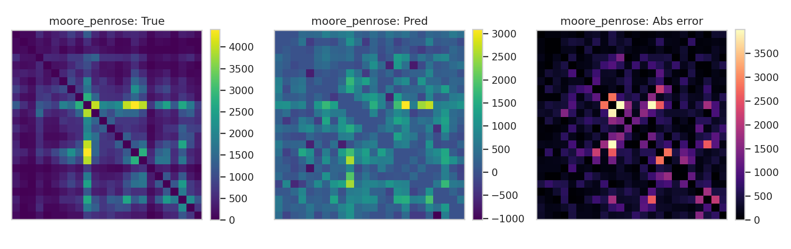

**Survey — Moore–Penrose.** Prediction is the min-norm particular solution. Abs-error highlights OD cells where the survey prior disagrees with $A^{+}x$. Forward is essentially exact; residual structure is almost pure null-space disagreement.

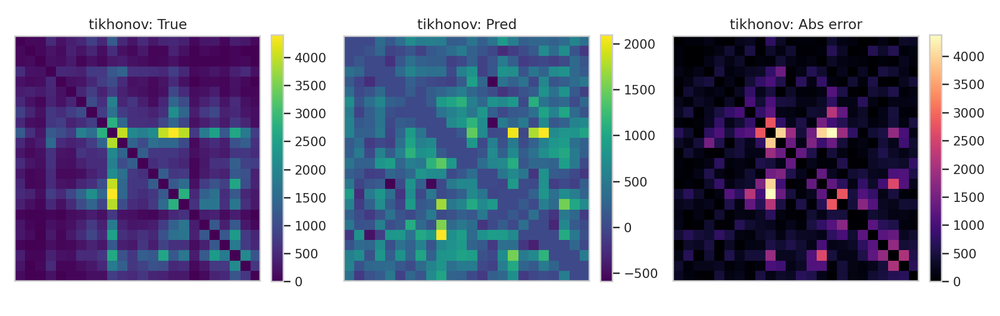

**Survey — Tikhonov.** Visually close to pinv at the selected tiny $\lambda$; slightly damped high-frequency content. Error map remains large in absolute OD units despite near-zero forward RMSE.

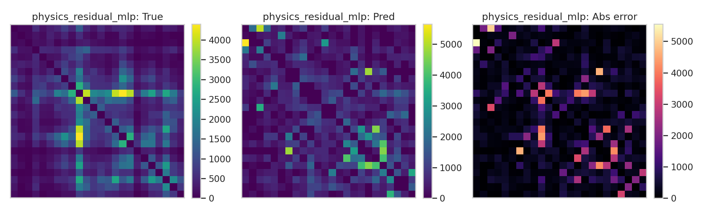

**Survey — Physics Residual MLP.** Anchored to survey base OD during training, yet still shows structured abs-error: the network learns a correction that does not fully recover the survey matrix under the synthetic training distribution / forward pressure.

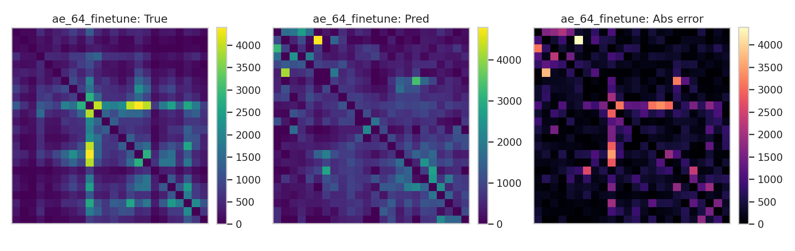

**Survey — AE-64 finetune.** Predictions are smoother / more compressed (latent bottleneck). Abs-error is broad; forward RMSE is large, consistent with decoder drift off the $A$-consistent set.

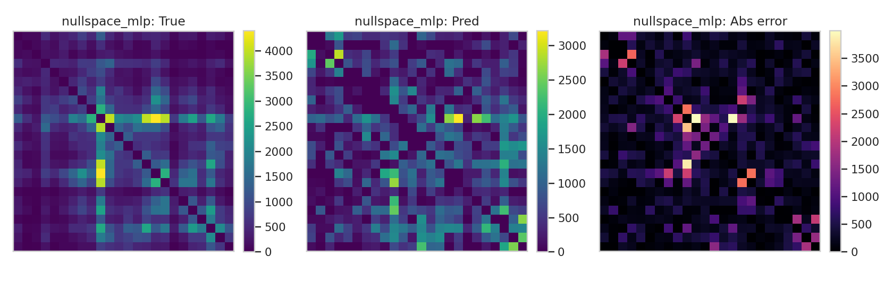

**Survey — Nullspace MLP.** Closest overall OD match among the five visualized models (MAE 395). Abs-error is reduced on many corridors relative to pinv while retaining more structure than AE; remaining errors concentrate where softplus / soft null penalty limit exact affine recovery.

### Synthetic sample heatmaps

Fixed first test index (`test_idx[0]=0` in `split_indices.npz`; local row 0 of each `test_pred.npy`). Meta: `figures/od_benchmark/synthetic_heatmap_meta.json`.

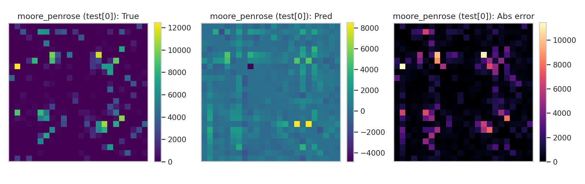

**Synthetic sample — Moore–Penrose.** Particular solution vs one FP draw. Abs-error shows where FP mass lives off the min-norm solution.

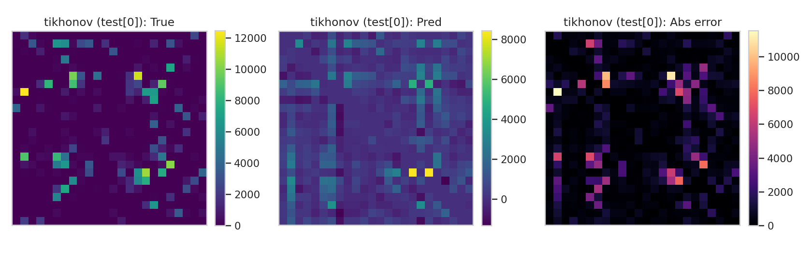

**Synthetic sample — Tikhonov.** Nearly identical story to pinv for this $\lambda$.

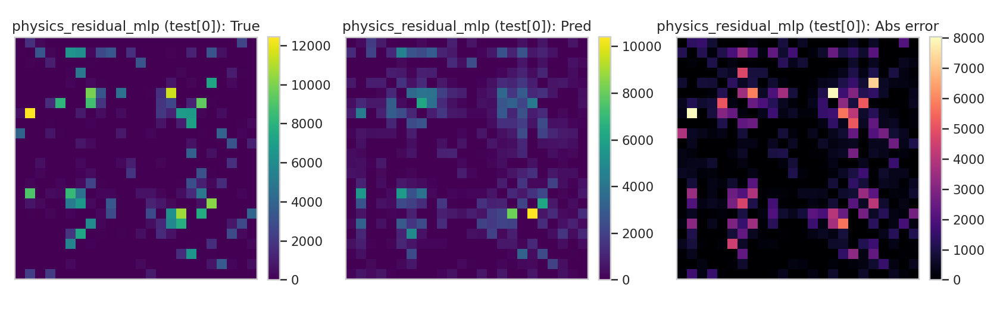

**Synthetic sample — Physics Residual MLP.** Closer to the FP sample than operator methods on many cells, but still imperfect; survey-base residual is a mismatched anchor for pure synthetics.

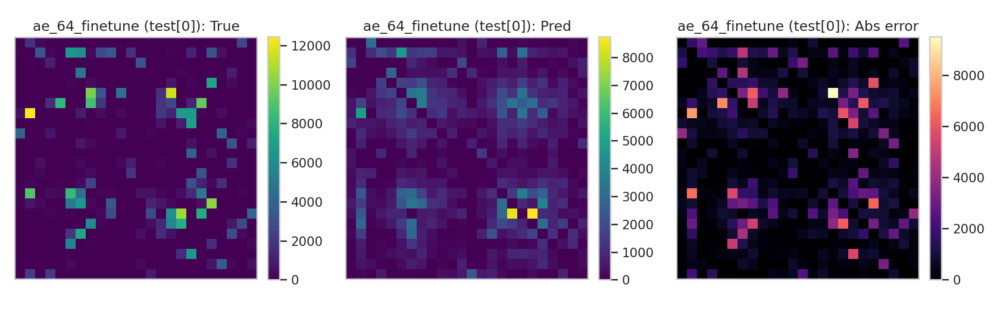

**Synthetic sample — AE-64 finetune.** Under-resolved corridors and larger abs-error than residual MLP family on this index.

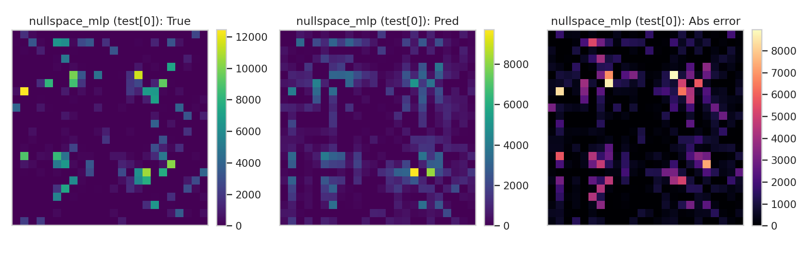

**Synthetic sample — Nullspace MLP.** Improves on pinv for this FP sample by adding a null correction; residual abs-error remains visible on heavy corridors.

Trip-distance / bin error heatmaps: **Not available in the current experiment artifacts.**

---

## Error structure notes

From survey metrics:

- Support Jaccard highest for PLS (1.0) and AE variants (~0.87–0.95); operator methods ~0.77–0.78.
- Pred sparsity often ≫ true sparsity (true ≈ 0.0417): models over-sparsify.
- Diagonal violation ≈ 0 after constraints; raw pinv has tiny diagonal leak ($8.4\times10^{-8}$).

Cell-wise spatial Moran's $I$ / corridor-wise errors: **Not available in the current experiment artifacts.**

---

## Computational profile

From `benchmark_results.csv` / JSON (seconds). Missing entries marked unavailable.

| Model | Parameters | Train time (s) | Inference time (s) |
|-------|-----------:|---------------:|-------------------:|
| moore_penrose | N/A | Not available | Not available |
| tikhonov | N/A | Not available | Not available |
| ridge | N/A | Not available | Not available |
| physics_ridge | N/A | Not available | Not available |
| pls | N/A | Not available | Not available |
| mlp | N/A | Not available | Not available |
| residual_mlp | 1 963 072 | 44.466550 | 1.201899 |
| physics_residual_mlp | 912 448 | 57.363631 | 1.143143 |
| ae_32 | 556 000 | 99.455975 | 1.032126 |
| ae_64 | 576 512 | 97.370932 | 1.036879 |
| ae_128 | 617 536 | 108.651230 | 0.942379 |
| ae_64_finetune | 576 512 | 128.678197 | 1.098481 |
| nullspace_mlp | 327 318 | 23.215592 | 1.081002 |

Full benchmark wall time: 628.862 s (`run_summary.json`). Peak GPU memory: **Not available in the current experiment artifacts.**

---

## Multi-criteria summary

| Criterion | Winner (artifacts) | Value |
|-----------|--------------------|------:|
| Synthetic OD MAE | mlp | 646.575605 |
| Synthetic composite | physics_ridge | 1.506216 |
| Synthetic forward RMSE | moore_penrose | $8.536\times10^{-5}$ |
| Survey OD MAE | nullspace_mlp | 395.114834 |
| Survey forward RMSE | moore_penrose | $3.607\times10^{-5}$ |
| Survey Pearson | nullspace_mlp | 0.488878 |

### Rankings by family

| Family | Best synthetic OD | Best survey OD | Best synthetic composite |
|--------|-------------------|----------------|--------------------------|
| operator | moore_penrose (731.19) | moore_penrose (444.14) | moore_penrose (3.391) |
| classical | ridge (697.99) | pls (418.04) | physics_ridge (1.506) |
| neural | mlp (646.58) | nullspace_mlp (395.11) | mlp (1.853) |
| autoencoder | ae_64_finetune (791.85) | ae_64_finetune (451.96) | ae_64_finetune (3.286) |

---

## Constraint ablations

Source: `outputs/benchmark/ablations/*_ablation.json`. Strategies: `none`, `relu`, `softplus`, `clip`, `clip_ipf`. Only mlp / ridge / moore_penrose were ablated.

### mlp (baseline already relu-constrained)

| Strategy | OD MAE | Forward MAE | Prod MAE | Attr MAE |
|----------|-------:|------------:|---------:|---------:|
| none | 646.575605 | 227.761460 | 1065.576750 | 1052.385208 |
| relu | 646.575605 | 227.761460 | 1065.576750 | 1052.385208 |
| softplus | 646.584119 | 227.911837 | 1065.824897 | 1052.614491 |
| clip | 646.575605 | 227.761460 | 1065.576750 | 1052.385208 |
| clip_ipf | 642.588341 | 338.328244 | 0.001530 | 0.000857 |

### ridge

| Strategy | OD MAE | Forward MAE | Prod MAE | Attr MAE |
|----------|-------:|------------:|---------:|---------:|
| none | 697.985720 | 0.139894 | 1100.213968 | 1093.815987 |
| relu | 652.740765 | 306.835866 | 1499.851585 | 1495.557018 |
| softplus | 652.743142 | 306.876982 | 1499.897464 | 1495.603761 |
| clip | 652.740765 | 306.835866 | 1499.851585 | 1495.557018 |
| clip_ipf | 637.722442 | 384.345463 | 0.001644 | 0.000856 |

### moore_penrose

| Strategy | OD MAE | Forward MAE | Prod MAE | Attr MAE |
|----------|-------:|------------:|---------:|---------:|
| none | 731.185951 | 3.738e-05 | 4705.106327 | 4706.964408 |
| relu | 666.719798 | 420.051229 | 3504.947987 | 3501.099084 |
| softplus | 666.696159 | 420.112940 | 3503.676531 | 3499.829185 |
| clip | 666.719798 | 420.051229 | 3504.947987 | 3501.099084 |
| clip_ipf | 729.222855 | 1450.579031 | 0.001985 | 0.000857 |

**Takeaway:** Nonnegativity (`relu`/`clip`) improves OD MAE for unconstrained classical/operator preds but **destroys** near-zero forward error. `clip_ipf` forces near-perfect marginals and worsens forward consistency — do not treat IPF as a free OD MAE win without reporting forward.

Ablations for other models: **Not available in the current experiment artifacts.**

---

## Theory ↔ implementation map

| Theory | Implementation path |
|--------|---------------------|
| $\mathbf{x}=A\mathbf{y}$ | `data.verify_forward_map`, `metrics_suite.forward_predictions` |
| $A^{+}$ | `operator.compute_operator`, `pinv_predict` |
| Tikhonov | `models/tikhonov.py` |
| Supervised Ridge | `models/ridge.py` |
| Physics refine | `models/physics_ridge.physics_refine` |
| $\hat{\mathbf{y}}=A^{+}\mathbf{x}+N f(\mathbf{x})$ | `models/nullspace_mlp.py` |
| Survey base residual | `data.base_od_flat` + `neural_train.logits_to_od(..., residual=True)` |
| Composite selection | `metrics_suite.composite_score`, `selection.attach_composite` |
| Constraints | `constraints.apply_constraint_strategy` |
| Benchmark driver | `src/ml/rigorous_benchmark/run.py` |

---

## Reproduction

```bash
# Full benchmark (long; uses paths in BenchmarkConfig / CLI)
python -m src.ml.rigorous_benchmark.run

# Smoke
python -m src.ml.rigorous_benchmark.run --smoke

# Regenerate documentation figures from existing artifacts
python scripts/generate_od_benchmark_doc_figures.py
```

Environment note: project targets conda env `ODEstimation` (see `requirements.txt`).

---

## Limitations

1. **One survey realization** — survey rankings are a single matrix (`EstimatedODMatrix.npy`), not a survey ensemble.
2. **Fixed $A$** — no stochastic assignment / congestion feedback.
3. **Synthetic → survey shift** — confirmed by scale diagnostics; FP prior ≠ survey prior.
4. **HPO budget** — 8 trials, 5k HPO train subsample, 25k final train cap: neural rankings are under a memory-safe protocol, not an exhaustive search.
5. **Missing timings/params** for early classical/MLP rows in the results table.
6. **No trip-length / entropy metrics** in saved artifacts.
7. SVD rank in this dump (170) differs from older analysis text (174); both are reported, not conflated.

---

## Next steps

Motivated by the nullity (406) and spatial OD structure: graph neural estimators on the zone graph or bipartite OD graph could encode corridor structure more explicitly than flat MLPs, while retaining a null-space head or forward loss. This is a **motivation**, not a claim of superiority — no GNN results exist in `outputs/benchmark/`.

Other next steps: multi-survey evaluation, equilibrium-consistent $A(\mathbf{y})$, richer HPO, and reporting train-time for all models.

---

## References

Citations verified against existing `docs/*.tex` bibliographies (Ortúzar & Willumsen; Cascetta; Furness; Deming & Stephan; Wilson). Classical inverse-problem / Tikhonov / Moore–Penrose statements follow the implementations and standard linear-algebra definitions used in code comments; standalone Tikhonov (1963) / Penrose (1955) bibliographic entries are **not** present in those `.tex` files and are therefore not fabricated here as numbered bibitems.

1. J. de D. Ortúzar and L. G. Willumsen, *Modelling Transport*, 4th ed., Wiley, 2011. (`ortuzar2011` in `docs/fp_od_generation_methodology.tex`, `docs/synthetic_od_method.tex`, `docs/od_estimation_methodology.tex`)
2. E. Cascetta, “Estimation of trip matrices from traffic counts and survey data,” *Transportation Research Part B*, 1984. (`cascetta1984`)
3. R. Furness, “Trip forecasting,” *Traffic Engineering and Control*, 1962. (`furness1962`)
4. W. E. Deming and F. F. Stephan, “On a least squares adjustment of a sampled frequency table…,” *Annals of Mathematical Statistics*, 1940. (`deming1940`)
5. A. G. Wilson, *Entropy in Urban and Regional Modelling*, Pion, 1970. (`wilson1970` in FP methodology)

---

## Artifact index and PDF

| Path | Role |
|------|------|
| `outputs/benchmark/benchmark_results.csv` | Test leaderboard |
| `outputs/benchmark/benchmark_results.json` | Full metrics |
| `outputs/benchmark/survey_inference/survey_results.json` | Survey metrics |
| `outputs/benchmark/*/best_params.json` | Fit hyperparameters |
| `outputs/benchmark/operator/operator_meta.json` | SVD summary |
| `outputs/benchmark/data/leakage_report.json` | Split / leakage |
| `outputs/benchmark/run_config.json` | Caps / weights / paths |
| `outputs/benchmark/ablations/` | Constraint ablations |
| `docs/figures/od_benchmark/` | Doc figures + `nullspace_diagnostics.json` |

PDF render (pandoc + XeLaTeX):

```bash
pandoc docs/OD_INVERSE_ESTIMATION_MODEL_BENCHMARK.md \
  -o docs/OD_INVERSE_ESTIMATION_MODEL_BENCHMARK.pdf \
  --from markdown --resource-path=docs --pdf-engine=xelatex \
  -V geometry:margin=1in -V mainfont="DejaVu Sans" -V monofont="DejaVu Sans Mono"
```

Markdown remains the editable source of truth; mermaid diagrams appear as fenced code in the PDF unless a mermaid filter is added.
